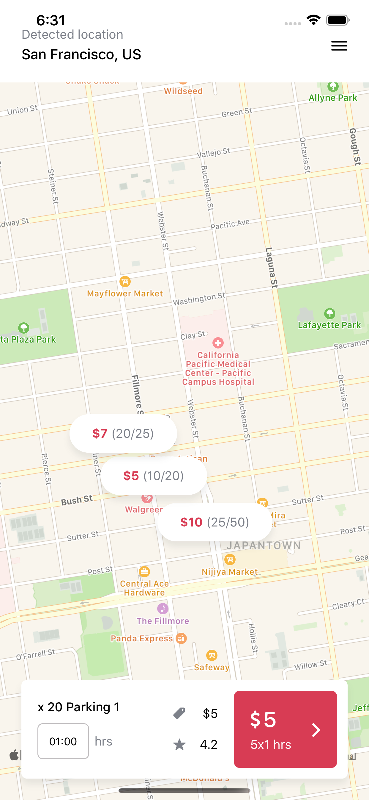

# Car Parking Finder (UI only)

This is a proof of concept for a mobile app that finds car parking in the local area and is written in React Native.

To see the demo version of the UI, please use QR scanner and hit open web page :)

